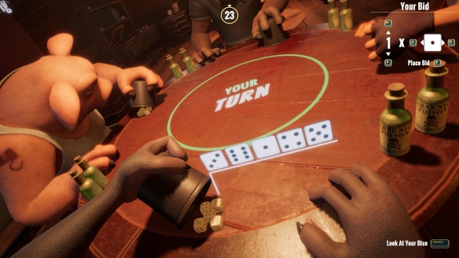
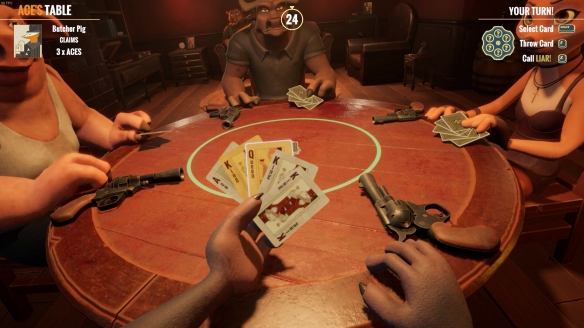

# 骗子酒吧

## 骰子模式

### 玩法介绍



骰子模式玩家需要根据自己的骰子和对其他玩家的猜测来叫牌，比如叫有5个4，
下一位玩家可以选择增加骰子数量，如5个5及以上，或则质疑上一位玩家的叫牌，
该模式中玩家面前有两瓶毒药，质疑失败的玩家要喝下一瓶毒药，喝下两瓶毒药则出局，最后存活的玩家获胜。

### 插件实现

游戏开始后，向每一位玩家私聊其骰子情况，例如`[3][6][1][4][5]`。

在群内，按照顺序`@玩家`让其说话。

玩家必须按照特定格式来喊话，例如 `4个5` 或者 `4x5`。

然后@下一位玩家，下一位玩家可以选择说 `开` 来质疑上一位玩家，或者继续报点直到有一位玩家质疑为止。

质疑时将该玩家的骰子情况在群里发出来并结算。

如果所言为真，则质疑玩家喝下一瓶毒药，若所言为假则被质疑玩家喝下一瓶毒药。

喝下两瓶毒药者出局，直到最后存活一名玩家获胜。


## 扑克牌模式

### 玩法介绍



扑克牌模式玩家轮流出牌并声明牌面数值，这个数值必须和桌面上的要求匹配，
玩家出牌时可能会对牌面数值撒谎，其他玩家若怀疑其撒谎，
可以揭穿，如果有人被揭穿且确实撒谎，就必须拿起桌子前面的左轮进行一轮俄罗斯转盘，
枪里只有一发子弹，活下来则可以继续游戏，失败则意味着游戏结束，转盘结束后，牌局重置继续。

回合开始一共20张牌，6张Q、6张K、6张A和2张小丑随机分发，每人5张，
每一轮对局会出现一张主牌，玩家根据主牌数量进行出牌，
其中小丑牌是赖子，小丑牌可以用来代替任何其他的牌。

如主牌是K，下图手中的牌就为三真两假，轮到自己需要选择一张牌打出，
如果觉得上家说谎了就可以选择开他的牌，如果开到了假牌，
上家拿起左轮对自己开一枪，如果开到真牌，则自己拿起左轮开一枪。

玩家开枪后重新抽取主牌，分发卡牌，开启新回合。

### 插件实现

游戏开始后，向每一名玩家私聊起抽取到的牌和选中的牌，
例如 `[J][J][Q][K][A]`，小丑牌用`[*]`表示。

轮到某位玩家时私聊玩家提示出牌，同时在群里发布提示轮到`@玩家`出牌。

玩家应当私聊bot发布自己想出的牌，例如本局抽到`[K]`为目标牌，玩家可以回复`JJQ`来打出3张牌。

玩家出牌后，分别在私聊中回复玩家剩余的牌，在群聊中提示`@玩家`出了`3张K`，剩余手牌`2`。

然后@下一位玩家出牌，下一位玩家可以选择在群聊或者私聊中发`开`来质疑上家，或者继续出牌直到有人质疑为止。

如果选择质疑，则翻开上家出的牌，若与描述不符，则被质疑者使用左轮手枪进行俄罗斯轮盘赌，否则质疑者进行轮盘赌。

如果所有牌都出完了没人质疑，则最后一位玩家失败。

小丑牌是癞子牌，在游戏里用`[*]`表示，玩家可以出类似`KK*`代表3张K。

## 游戏参与方式

当有人在群里发 `骗子酒吧` 时，进入主菜单。

```text
欢迎来到骗子酒吧，要来一把紧张刺激的劈骰子还是阴险狡诈的劈扑克呢？
回复“骰子”或“扑克”创建房间
```

此时玩家可以选择任一选项进行房间创建，例如“骰子”

```text
玩家@xxx创建了骰子房间(1/4)，发送“加入”参与游戏，发送“退出”离开房间。
```

此时其它玩家可以通过发送“加入”来进入房间，每一个群同时只能有一个房间。

房主可以通过回复“退出”来离开房间，没人的房间将会关闭，之后才能开启新的房间。

房间在每一次有人加入时都会刷新计时器，超过一定时间没有人开始则会自动解散。

当其它玩家加入时会提示：

```text
玩家@yyy加入了骰子房间(2/4)，发送“加入”参与游戏，发送“退出”离开房间。
当前玩家：@xxx，@yyy
房主发送“开始”可以开始游戏。
```

玩家离开时会提示：

```text
玩家@xxx离开了骰子房间(1/4)，发送“加入”参与游戏，发送“退出”离开房间。
当前玩家：@xxx
```

当所有玩家都离开时：

```text
玩家@xxx解散了骰子房间，欢迎下次再来。
```

当最后一个玩家加入时，游戏自动开始：

```text
玩家@xxx加入了骰子房间(4/4)，人数已满，房主发送“开始”即可开始游戏。
```

开始后则由对应的游戏控制器处理，如骰子开局：

群聊：
```text
请各位在私聊中查看自己的点数，由@xxxx开始发言。
你可以通过发“X个Y”或者“X*Y”喊数。
```

私聊：
```text
你投出了[1][3][6][4][5]
请通过“X个Y”或“X*Y”喊数
```


如扑克开局：

群聊：
```text
请各位在私聊中查看自己的手牌，并私聊出牌。
本局目标牌为[K]，由@xxx开始出牌。
```

私聊：
```text
手牌：[J][J][Q][K][K]，目标牌：[K]
请出牌
```

当有人喊话或者出牌时：

骰子：

```text
玩家@xxx喊话4个3，轮到@yyy发言。
你可以发“开”来质疑，或者发"X个Y"继续喊数。
必须喊出数量或点数大于上家才能继续！
```

扑克：

```text
玩家@xxx出牌3张[K]，剩余2张手牌，轮到@yyy出牌。
你可以发“开”来质疑，或者在私聊中出牌来继续。
```

同时在私聊中也会提示相同的内容并附带玩家当前的手牌状态：

```text
上家出牌3张[K]，剩余2张手牌，轮到你了
你可以发“开”来质疑，或者继续出牌
手牌：[K][K]，目标牌：[K]
```

如果此时该玩家已经没有手牌，则提示：

```text
上家出牌3张[K]，剩余2张手牌，你已经没有手牌了，本轮跳过。
```

当有玩家质疑时：

骰子：

```text
玩家@xxx质疑@yyy说的X个Y

开蛊：
@xxx [2][3][4][5][5]
@yyy [2][3][4][5][5]
@zzz [2][3][4][5][5]
@kkk [2][3][4][5][5]

一共X个Y

质疑成功，玩家@yyy喝下一瓶毒药，剩余一瓶。
质疑成功，玩家@yyy喝下最后一瓶毒药，出局。
质疑失败，玩家@xxx喝下一瓶毒药，剩余一瓶。
质疑失败，玩家@yyy喝下最后一瓶毒药，出局。

场上情况
@xxx(1/2),@yyy(2/2),@zzz(1/2),@kkk(0/2)
房主@xxx发送“继续”进行下一轮
```

扑克：
```text
玩家@xxx质疑@yyy出的3张K

开牌：[K][K][*]

质疑成功：玩家@yyy拿出了左轮手枪，啪，没有子弹射出(2/6)
质疑成功：玩家@yyy拿出了左轮手枪，嘭！出局！(2/6)
质疑失败：玩家@xxx拿出了左轮手枪，啪，没有子弹射出(2/6)
质疑失败：玩家@xxx拿出了左轮手枪，嘭！出局！(2/6)

场上情况
@xxx(1/6)，@yyy(2/6)出局，@zzz(0/6)，@kkk(1/6)
房主@xxx发送继续进行下一轮
```

当仅剩最后一名玩家时：

```text
游戏结束，恭喜@xxx笑到最后！
发“骗子酒吧”再来一局。
```

---

> 玩法介绍来源：[游侠网](https://gl.ali213.net/html/2024-10/1518387.html)